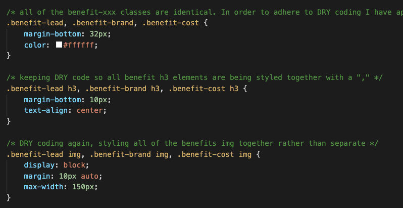

# <horiseonRefactor>

## Description
This is a refactor of code for the Horiseon home page. 

The objective is to maintain the look and feel of the site while improving its functionality, to make semantic and accessibility changes, and clean up any repetition or unnecessary code.

-I learned the value of semantic html not just in its functionality, but its ability to make the document much easier to understand and navigate.

-I also saw the value of adding accessibility to the document so users with vision impairments can easily navigate the site.

-And I realized how important it is to keep your stylesheet labeled, orderly, and DRY.

## Git links
Github repo URL: https://github.com/hackpres/horiseonRefactor
deployed application URL: https://hackpres.github.io/horiseonRefactor/

## Screenshots of deployed app

## usage
The original document was just div elements nested in div elements. It was difficult to decipher and would be a nightmare to debug.

After my refactor the document maintained its look and feel while also recieving some necessary functionality improvements.

The original stylesheet was mostly ordered properly, with a few exceptions. but suffered from multiple repetitions.

After the refactor the stylesheet is much cleaner, easier to navigate, and is DRY!
